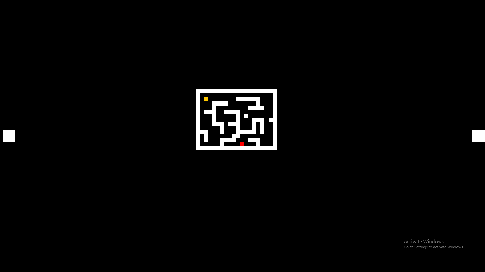

# SSVEG
Play Maze using SSVEG.
There are four blinking rectanges in four corners of the screen indicating four directions: up, bottom, left, right.
The player will move based on the rectangle that we gaze at.
Canonical Correlation Analysis(CCA) is used to decode the EEG.

